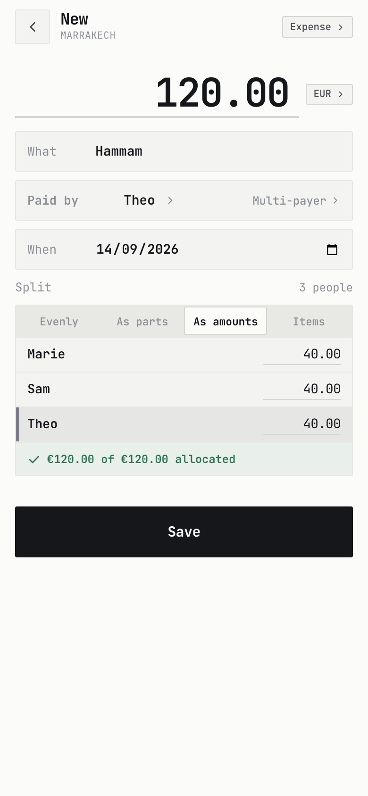

  

<h1 align="center">bida</h1>

No-nonsense expense splitter.

  <a href="https://bida.bid"><b>bida.bid</b></a>
  &nbsp;·&nbsp;
  <a href="SELFHOSTING.md">Self-hosting</a>
  &nbsp;·&nbsp;
  <a href="docs/README.md">Docs</a>

This is a personal project, almost entirely vibe-coded with Claude Code.

<table>
<tr>
<td width="25%"></td>
<td width="25%"></td>
<td width="25%"></td>
<td width="25%"></td>
</tr>
</table>

## How it works

**No accounts.** A group is a secret link, and that link is also the key that
opens it. What reaches the server is sealed: it can count how many groups
exist and how many edits each has had, and that's it.

**No signal needed.** Every change is an appended op in IndexedDB, never an
edit in place, so two phones writing up the same dinner underground merge
cleanly when they surface.

**One part isn't private.** Receipt photos go to Google's Gemini API, which may
train on them.

## Stack

Next.js static export · hand-rolled components · Tailwind · Dexie/IndexedDB ·
Cloudflare Worker + D1.

## Hosting cost

The core functionality is hosted for free on Cloudflare. The fancy LLM-powered
receipt scanning is very cheap and funded by a tip jar.

## Running your own

Relatively easy to self-host. You'll need a Gemini API token, and some
understanding of Cloudflare. [SELFHOSTING.md](SELFHOSTING.md).

## Licence

[MIT](LICENSE)
