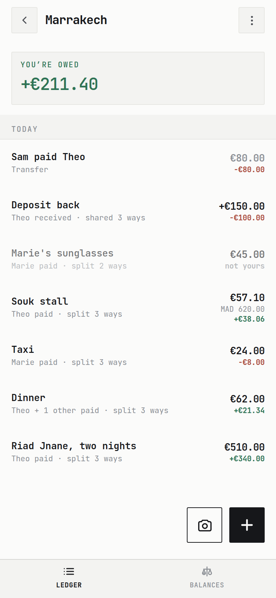
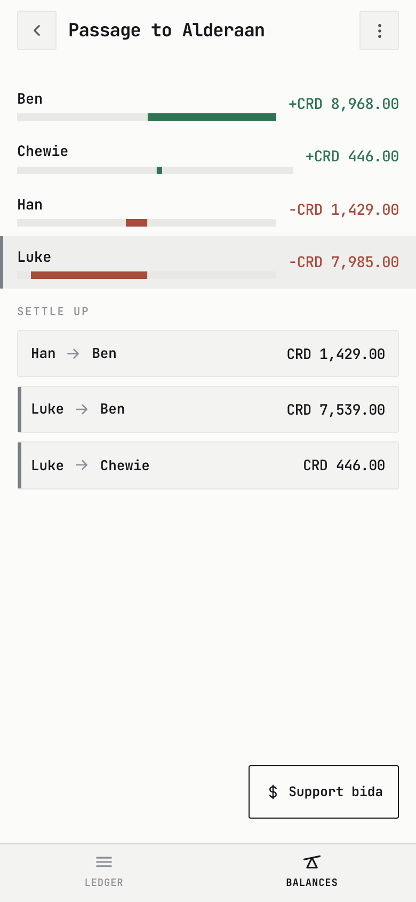
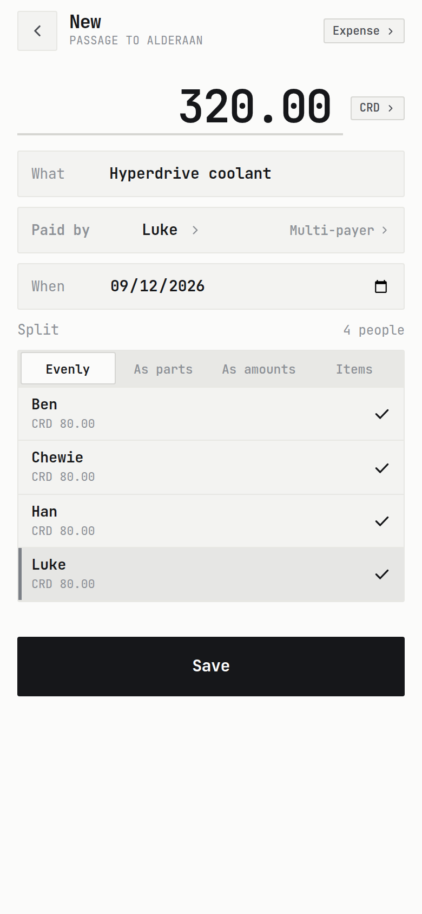
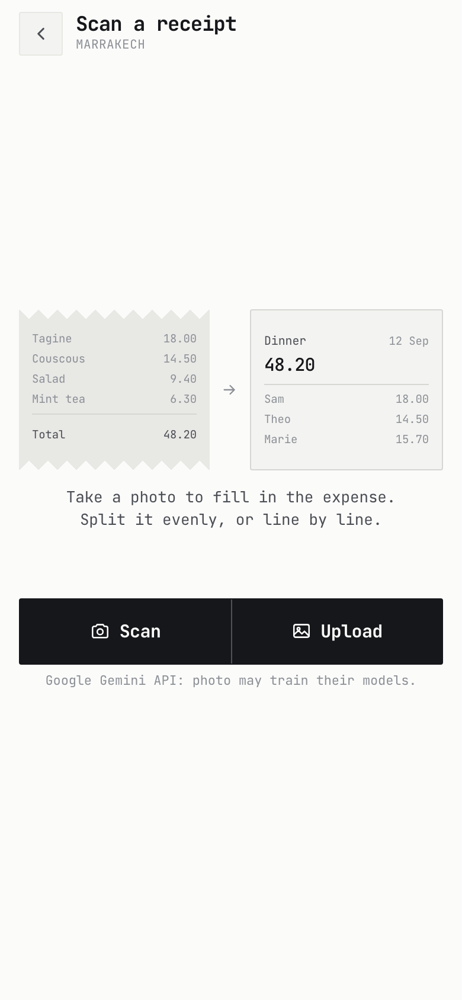
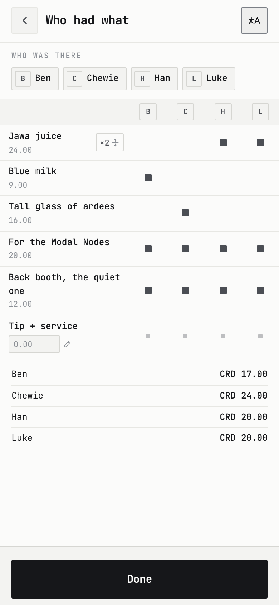
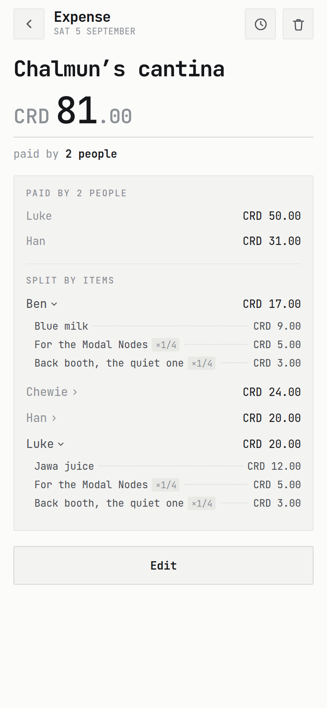

  

<h1 align="center">bida</h1>

Lightweight, full-featured and free Splitwise/Tricount alternative.

  <a href="https://bida.bid"><b>bida.bid</b></a>
  &nbsp;·&nbsp;
  <a href="SELFHOSTING.md">Self-hosting</a>
  &nbsp;·&nbsp;
  <a href="docs/README.md">Docs</a>

<table>
<tr>
<td width="33%"></td>
<td width="33%"></td>
<td width="33%"></td>
</tr>
<tr>
<td width="33%"></td>
<td width="33%"></td>
<td width="33%"></td>
</tr>
</table>

## Features

The usual stuff, plus:

- **No accounts.** A group is a secret link. Anyone with the link can edit.

- **Online, or installable PWA.** Click the link and you're in.
You can also add bida to your Android or iOS device, no app store required.

- **Works offline.** Append-only data model prevents merge conflicts.

- **End-to-end encrypted.** Decryption happens locally via the URL hash. The server only ever sees scrambled ciphertext.

- **Receipt parsing and itemized splitting.** Extracts line items from receipt photos.
Grid-like UI for assigning who-had-what.

- **Quick split.** Run a scan and assign items without creating a group. Screenshot the summary or copy a text version.
  
- **Auditable edit history.** If you don't trust your friends.
  
- **Dark mode.** Of course.
  

## Vibe-coded... carefully

This is a personal project, almost entirely written with Claude Code.

However, it's not a one-prompt type of thing, I put some love into this.
Core logic is well tested, and the UI/UX have been polished and debugged with care.
Have a look at [CLAUDE.md](CLAUDE.md) to see the development setup, or at
[docs/claude_corner.md](docs/claude_corner.md) to see what the AI thinks about
its own work.

## Stack

Next.js static export · Tailwind · Dexie/IndexedDB ·
Cloudflare Worker + D1.

The core functionality is hosted for free on Cloudflare. The LLM-powered
receipt scanning is very cheap and funded by a tip jar.

## Self-hosting

If you want even more privacy, or you'd like to hook up your own Gemini API key for
unlimited scans, bida is relatively easy to [self-host](SELFHOSTING.md).

## Licence

[MIT](LICENSE)
