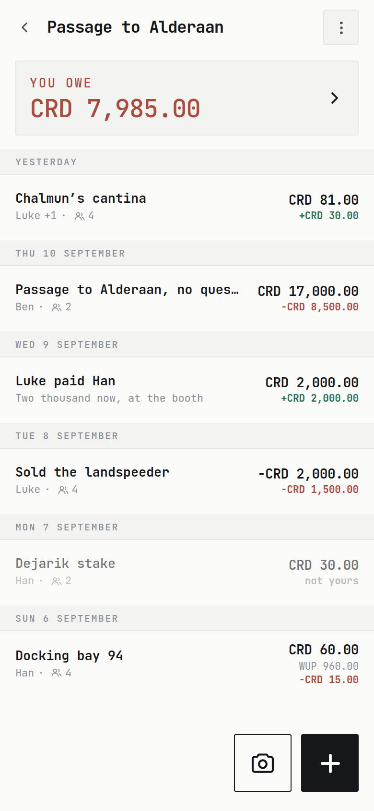
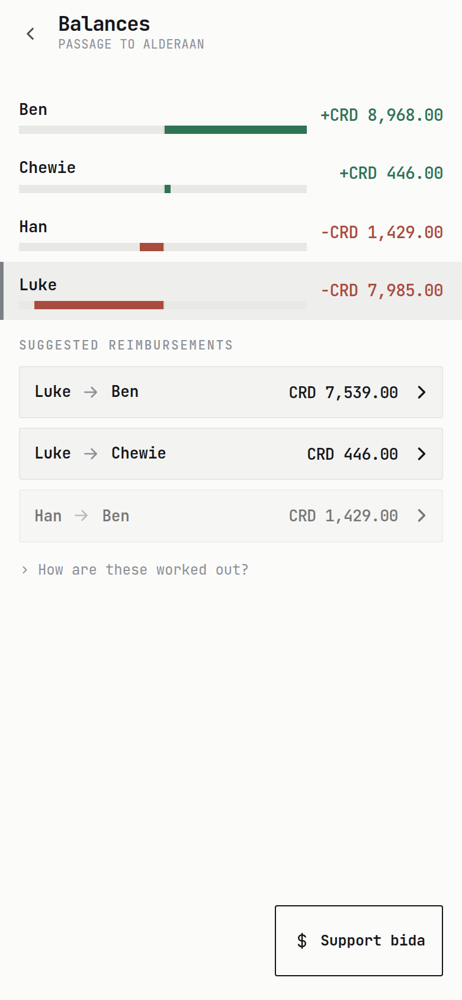
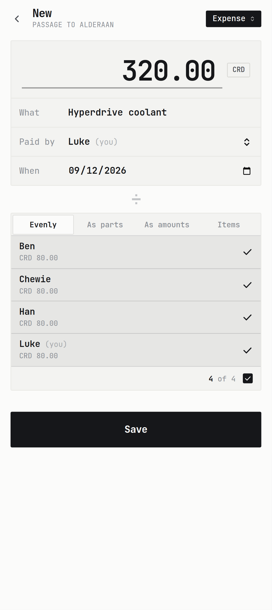
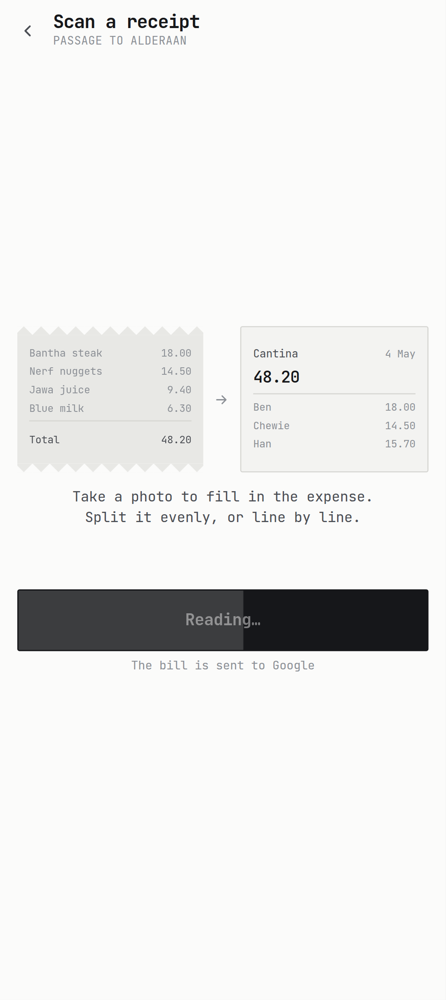
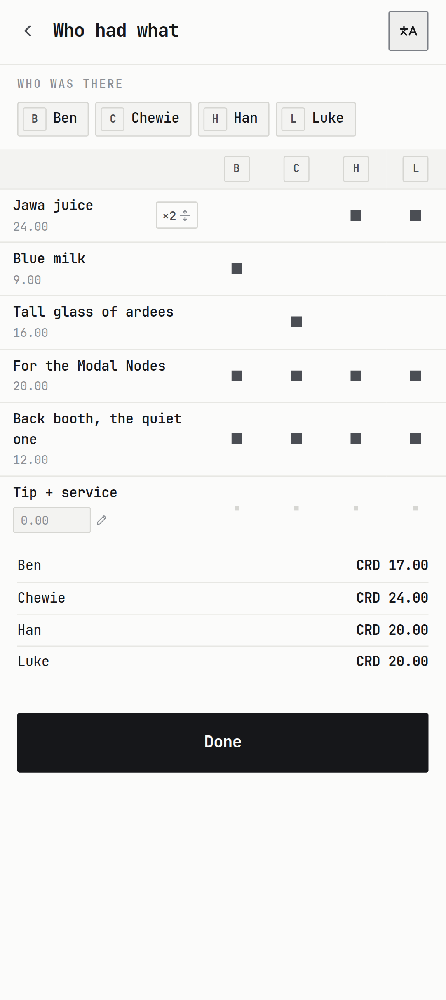
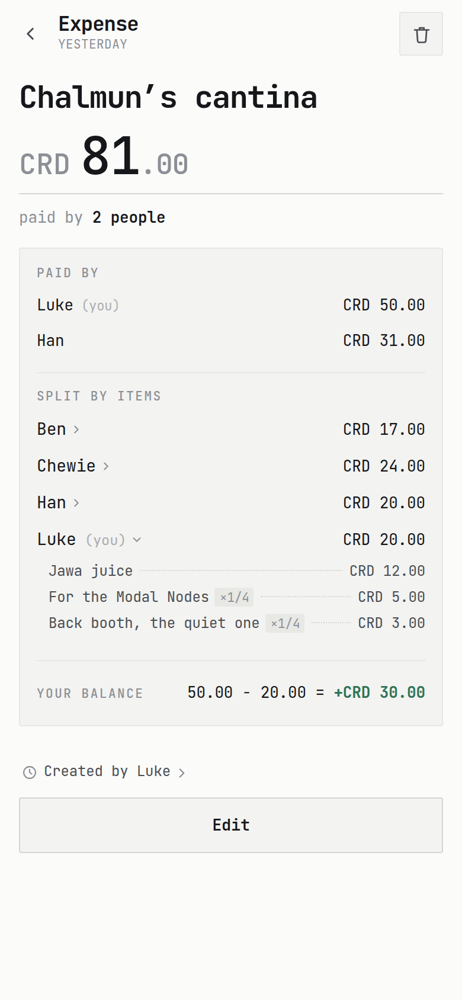
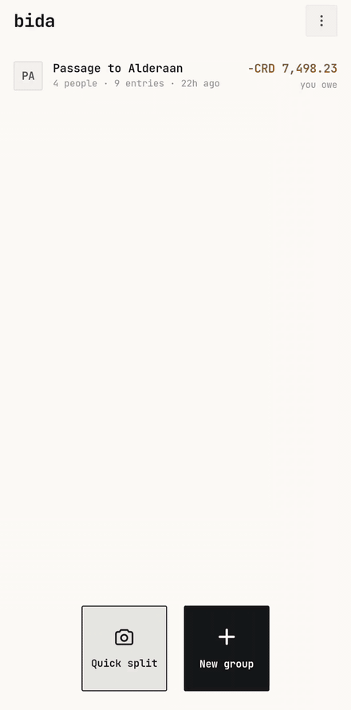

  

<h1 align="center">bida</h1>

<i>Split things. Mostly bills.</i>

bida is an expense splitter app similar to Splitwise or Tricount. It's free and it works in the browser, no accounts needed. Also, it lets you scan and split receipts by items.

  <a href="https://bida.bid"><b>bida.bid</b></a>
   
  or try the <a href="https://bida.bid/demo">demo group</a> first

<h3>Gallery</h3>

<table>
<tr>
<td width="33%"></td>
<td width="33%"></td>
<td width="33%"></td>
</tr>
<tr>
<td width="33%"></td>
<td width="33%"></td>
<td width="33%"></td>
</tr>
</table>

<h3>Quick split demo</h3>

  

## Features

- **Split expenses.** As an expense splitter might. Multi payer, uneven splits, debt simplification, etc.

- **No accounts.** A group is a secret link. Click it and you're in, no app, no login. Helpful if you have Splitwise-resistant friends.

- **Online, or installable PWA.** You can add bida to your Android or iOS device, no app store required.

- **Works offline.** Append-only data model prevents merge conflicts.

- **End-to-end encrypted.** Decryption happens locally via the URL hash. The server only ever sees scrambled ciphertext. *See the disclaimer below!*

- **Receipt parsing and itemized splitting.** Extracts line items from receipt photos. Grid-like UI for assigning who-had-what.

- **Quick split.** Run a scan and assign items without creating a group. Screenshot the summary or copy a text version.

- **Notifications.** When your balance changes.

- **Auditable edit history.** If you don't trust your friends.

- **Splitwise/Tricount import and export.** Bring groups in and out via CSV or Tricount link.

- **Dark mode.**

### Might add

These features exist in other splitters. I might add them if people ask.

- **Expense categories.** Annotating expenses as travel, food, etc.

- **Spending stats.** Some expense splitters track the amounts per person, per category etc.

- **Recurring payments.** E.g. for utility bills in a shared flat.

- **Search in group.**

### Won't add

- **Image hosting.** Keeping the app text-only is what makes it dirt cheap to run. The item details from receipts aren't lost, they can be parsed and stored in text form too.

## Privacy needs an audit

I am not a cybersecurity expert! The whole thing is set up to be E2EE compatible, the data is encrypted, and the key never reaches the server... But I can't guarantee there isn't some subtle fingerprinting possibility or other bug. I hope to eventually get a code audit from someone with credentials. For now, please treat bida as "probably E2EE".

## Vibe-coded... carefully

This is a personal project, almost entirely written with Claude Code, but I put love into it.
Core logic is well tested, and the UI/UX have been polished and debugged over hundreds of iterations.
It was a fun meta problem to keep the repo coherent and the iteration speed fast
as the app grew. Check [CLAUDE.md](CLAUDE.md) if you're curious about the setup.

## Stack

Next.js static export · hand-written CSS · Dexie/IndexedDB ·
Cloudflare Worker + D1.

The core functionality is hosted for free on Cloudflare, and would need around 100k users to exceed the free plan's limits. The LLM-powered
receipt scanning costs around 0.1 cent each and is funded by a tip jar.

## Self-hosting

If you'd rather run it yourself, or want to hook up your own Gemini API key for
unlimited scans, bida is relatively easy to [self-host](SELFHOSTING.md).

## Feedback welcome (and needed)

bida is very young and only tested on a couple of devices. Drop me a bug report, a PR, or an [email](mailto:teodor.lamort@gmail.com)!

## License

[MIT](LICENSE)
